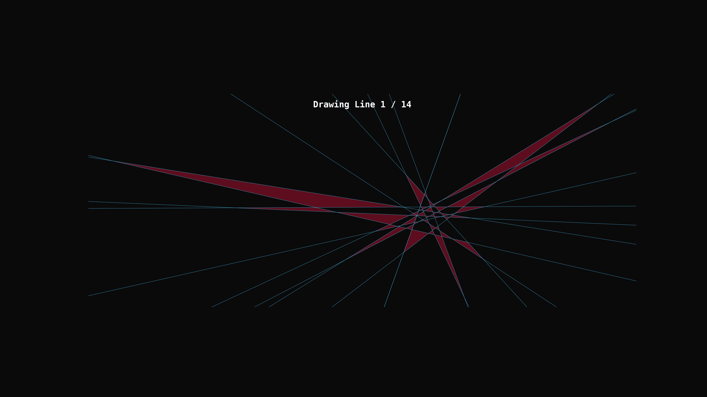

# RETRACTED — Invalid K(14)=54 Candidate

> [!CAUTION]
> **The previously claimed `K(14)=54` result is invalid.** Independent review on 17 February 2026 exposed an error in the validation pipeline: the same topological space in the micro-cluster was double-counted as two distinct triangles (triangles 8 and 9). Consequently, this repository **does not establish `K(14)=54`**. The related preprint was halted and the associated OEIS submission was withdrawn. Code, data, and historical materials are retained for transparency and historical reproducibility of the failed attempt.

## Current status

- **Scientific status:** retracted / invalid candidate.
- `data/solutions_run2/N14_K54_3c335303.json` is retained as the coordinate set associated with the failed claim; it is **not** a valid `K(14)=54` solution.
- Exact historical manuscript, validation, and visualization source files are preserved under filenames beginning with `RETRACTED__historical`.
- Their former public entrypoint paths now contain retraction notices instead of validation claims.
- Search code, datasets, coordinates, and Git history are unchanged.
- The misleading standalone `paper/main.pdf` was removed from the current tree; its exact binary remains preserved in Git history.

## Historical candidate visualization

The animation below is retained as a historical artifact of the invalid candidate. It is **not** a valid construction or proof of `K(14)=54`.

## What happened

Project Hycarus used a GPU-accelerated genetic search and a Vectorial Taboo Search strategy to explore configurations of 14 lines. A candidate was initially scored as having 54 non-overlapping triangles, and a CPU float64 validator appeared to reproduce that count.

Independent review identified a problem in the micro-cluster. Reinspection showed that the validation pipeline had counted the same topological space twice as triangles 8 and 9. That double-count invalidates the reported total of 54 for this candidate.

No attempt is made in this repository state to repair or replace the mathematical result.

## Repository structure

- `/data/`: original search data and candidate coordinates, unchanged.
- `/src/`: search code plus corrected public entrypoints; exact historical validator/visualization scripts are retained under explicit `RETRACTED__historical...` names.
- `/assets/`: historical renders and animations, unchanged.
- `/docs/`: corrected public entrypoints plus exact historical drafts/logs under explicit retracted filenames.
- `/paper/`: retraction notice and exact historical manuscript source. The old compiled false-claim PDF remains recoverable from Git history.

## Retraction record

On 17 February 2026, external review prompted a reinspection of the micro-cluster. The CPU validation pipeline was found to have double-counted the topological space associated with triangles 8 and 9. The `K=54` count for the candidate was therefore invalidated, the preprint was halted, and the related OEIS submission was withdrawn.

This repository is preserved as a transparent record of the failed computational claim and its correction.
